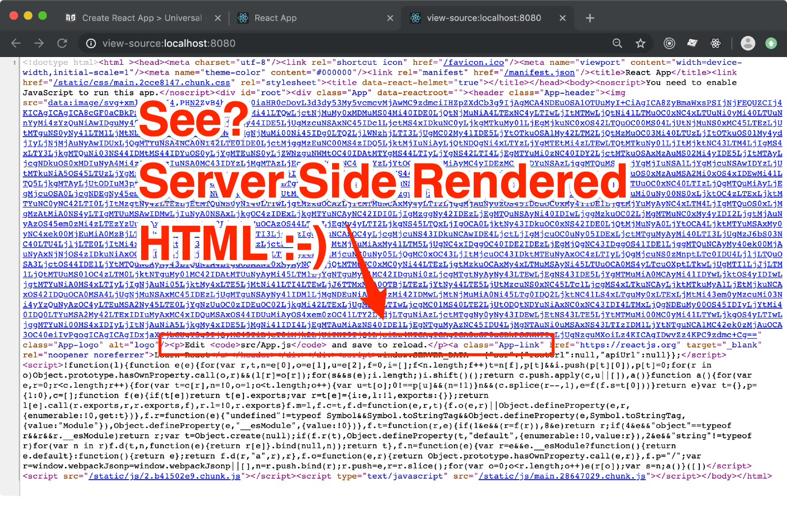

In this step-by-step tutorial you are going to take a
[Create React App (CRA)](https://facebook.github.io/create-react-app/)
app, and turn it into a fully featured
**Universal PWA with server-side rendering**,
served by an [ExpressJS](https://expressjs.com) server.

> **NOTE:**<br>
> If you just want to enjoy a ready-to-use and feature-rich app, type this in a terminal:<br>
> `npx forrest run my-new-universal-cra -p 8080`
>

## Step n.1 - Kickoff your CRA

Initialize a new CRA project (*):

    npx create-react-app my-new-universal-cra && \
    cd my-new-universal-cra

## Step n.2 - Add a few Dependencies

Now install some `ForrestJS` modules:<br>
(I personally use [`yarn`](https://yarnpkg.com) because is much faster than `npm`)

    yarn add @forrestjs/package-universal && \
    yarn add @forrestjs/package-universal-dev -D

> The `package-universal` contains a set of common dependencies like _React_, _Express_,
> _react-router_, ect... We work hard to keep all the internal versions up-to-date
> so you can enjoy and **update just this package** :-)

## About NPM Scripts

So far we just installed dependencies so the basic _package.json scripts_ that were created
by `create-react-app` are in place with their default behavior.

**This will not change during the course of this tutorial :-)**

I really like the idea of having a common ground in `create-react-app` (even if I
don't share all the decisions they made!) and I did my best to provide a simple
way to enrich that basic ground without breaking it.

With all that said, you can spin up your app:

      npm start


## Step n.3 - Let's Server-Side Render!

In order to implement SSR with ForrestJS you are going to need 3 things:

1. A Sever-Side entry point for your App
2. A NodeJS server - we'll use ExpressJS
3. Some @babel support for our server-side code (I love ES6, you?)

### Server-Side Entry Point

Create the App's server-side entry point:

```bash
vi src/index.ssr.js
```

and paste this code into it:

```js
import { createSSRRender } from '@forrestjs/core/lib/create-ssr-render'

// project specific modules
import App from './App'
import './index.css'

export const staticRender = createSSRRender(App)
```

### Modular NodeJS Server

Create the Express server entry point:

```bash
vi server.js
```

and paste this code into it:

```js
// Makes NodeJS understand ES6
process.env.NODE_ENV = 'development'
require('@babel/polyfill')
require('@babel/register')

// List our server capabilities
const services = [
    require('@forrestjs/service-express'),
    require('@forrestjs/service-express-ssr'),
]

// Start the app
require('@forrestjs/hooks')
    .createHookApp({ services })()
    .catch(err => console.log(err.message))
```

### Babel up and Go!

Edit your `package.json`:

```bash
vi package.json
```

and add the `babel` section and the `serve` script:

```json
"babel": {
  "presets": [
    "@forrestjs/babel-preset-universal"
  ]
},
"scripts": {
    "serve": "yarn build && node server.js",
    ...
}
```

It's finally time to run the App:

    yarn serve

You should now be enjoying a server-side rendered Create React App (or `CRA-SSR` for the whom who
like acronyms :-).

It looks exactly like the client side rendered that you get with `yarn start`, but it's
server-side rendered. You can look at the page's source and spot some content within the HTML.



This is going to be a hell of an improvement if you are targeting Google's bot as a steady
visitor of your website/PWA.

In the next lesson, you are going to **fix some headers** and **add some routes**.

## (*) react-scripts-rewired

Most of the examples work with the default setup, but when it comes to
the **server side rendering of an application that implements code splitting** with
[react-loadable](https://github.com/jamiebuilds/react-loadable) you are going to
need to make a small fix to the default [Webpack](https://webpack.js.org/) configuration.

I usually use [react-scripts-rewired](https://www.npmjs.com/package/react-scripts-rewired)
which implements a light extension of the default `react-scripts` package and allows
our project to extend the default configuration:

    npx create-react-app cra-ssr --scripts-version react-scripts-rewired

If you have already created your app, you should simply switch from

    "react-scripts": "3.0.1"

to:

    "react-scripts-rewired": "3.0.1--latest1",

(`react-scripts-rewired` follows (give or take) the same version of `react-scripts`)
