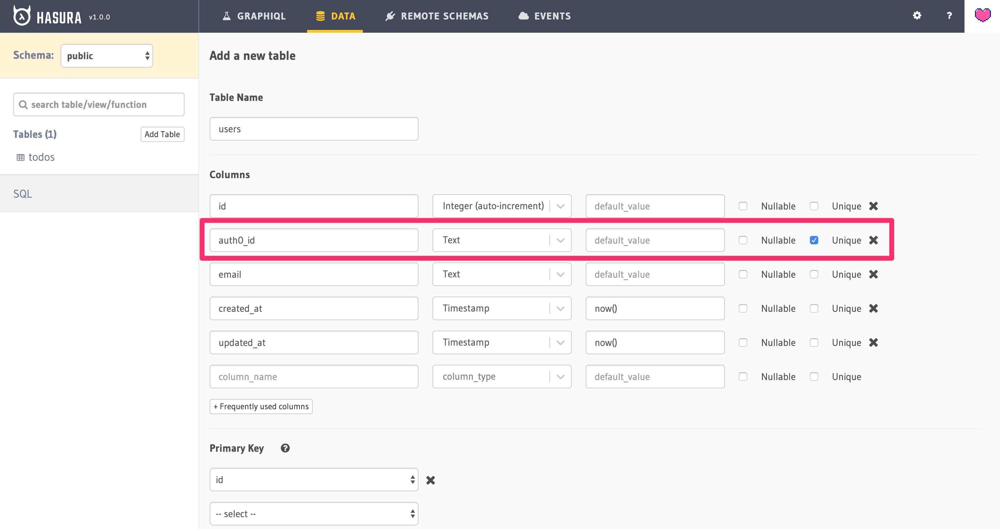
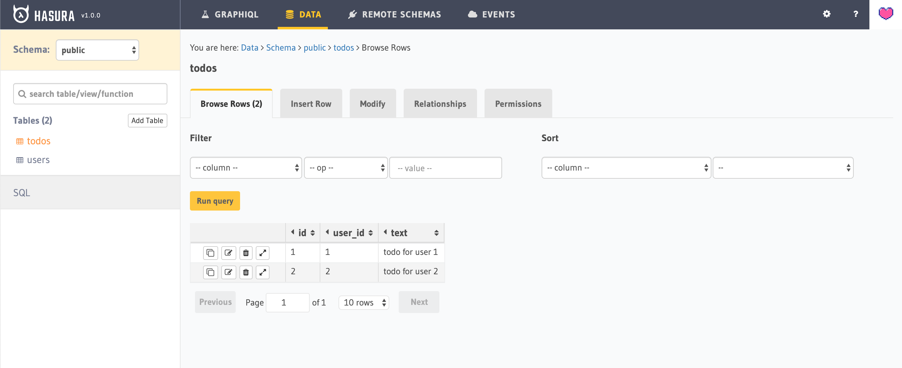
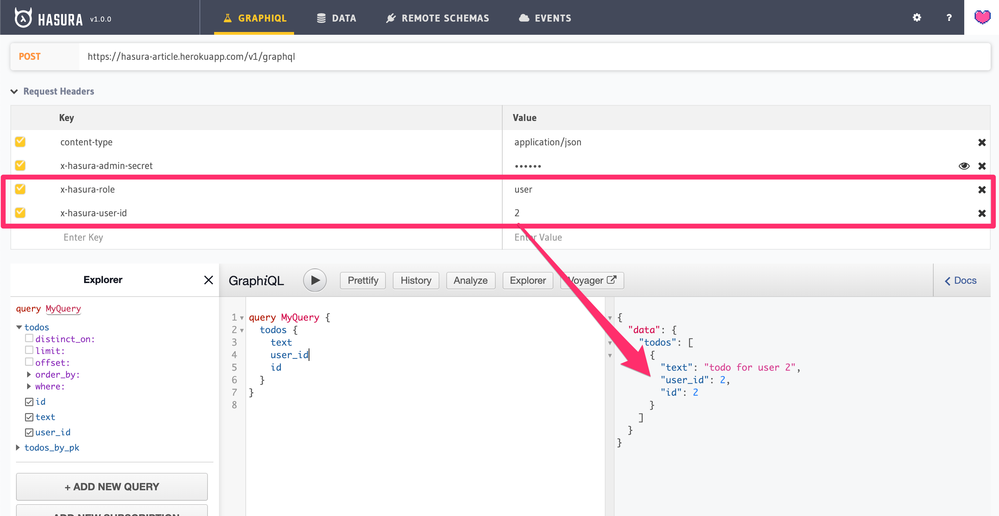
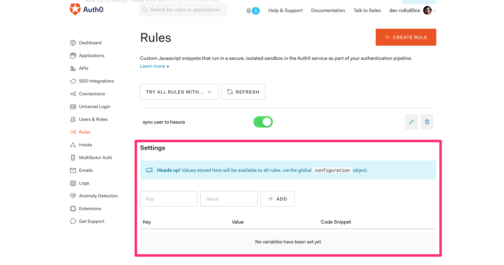
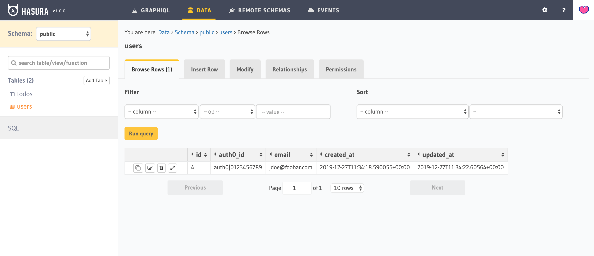

## Overture

I've been struggling to put together the pieces of documentation that you need to have this working properly.

With hindsight, it was an easy-peasy task, but some of the steps are not so straightforward nor sufficiently explained 
in the projects' docs.

By the end of this tutorial you are running a _Full Stack_ app that can signup/login users and persist
user data in a backend service.

## The Main Characters

[Hasura][hasura] is a real time [GraphQL][gql] engine. It sits between your frontend and [PostgreSQL][pg] database 
and build up a schema that **you can easily query from your frontend** project or other services.

Hasura is Open Source and **you can run it entirely for free** thanks to [Docker][docker] (locally
or on premise) and [Heroku][heroku] (on the cloud).

[Auth0][auth0] is a commercial _Authentication/Authorization as a Service_. It handles all your signup/login
logic for you, and it applies top-shelf safety guidelines.

Although Auth0 is not free, they offer a **generous free-tier up to 7k users** to kick-start your project, and later
on the pricing model is decent. It definitely costs less than maintaining an engineer that focuses on safety!

## The Plot

Here is a brief list of the steps that you are going to take in order to get things up and running:

1. Setup an Auth0 Account & App
2. Setup an Hasura App on [Heroku][heroku]
3. Prepare your backend with users and todos endpoints
4. Configure Auth0 to sync users with Hasura
5. Configure Auth0 to generate an Hasura compatible authentication token ([JWT][jwt])
6. Setup a React SPA on [Gitpod][gitpod]
7. Login/Logout users
8. Persist and query users data from the backend

## Setup an Auth0 Account & App

Head to [Auth0][auth0] home page and signup using one of the available social signup. 

Once you are in, you need to go through a few configuration steps that **setup your first tenant**.
You can consider _tenant_ as a bucket of users, give or take, you will use a new tenant for a new project.

Now you are ready to setup your first app:

1. Go to "Applications -> Default App -> Quick Start"
2. Choose the "Single-Page App -> React" combination
3. Follow the tutorial how to set up your Auth0 App
4. Download the demo app and run it to test it

**👉 IMPORTANT:** Auth0 comes pre-configured with a generic Google login. Although this will work out of the box,
you will notice that **your app looses the login status at every full-page refresh**. This happens because you 
should fully configure the connection between Google and Auth0 by creating a Google App ID and secret. 

This configuration is out of the scope of this tutorial, and I simply suggest to use the email/password signup/login.
That will work just fine 😀.

## Setup an Hasura App on Heroku

This step consists in following the ufficial documentation from the Hasura website:  
https://docs.hasura.io/1.0/graphql/manual/getting-started/heroku-simple.html

I feel this is a **great quick start experience** with the "Deploy to Heroku" button:

1. From the documentation page click on "Deploy to Heroku"
2. Choose you App's name and region
3. Click on "Deploy App" (wait a minute or two)
4. Click on "View App" to open the Hasura dashboard 🤪

Can anything be easier than that?  
I don't think so!

**👉 IMPORTANT:** After you play around with some [basic Hasura introduction tutorials][hasura-basics], I strongly suggest you go through the
[Securing the GraphQL endpoint tutorial][hasura-secret].

_That's all Folks!_ before you move on, I suggest you play around with some basic Hasura tutorials how to build
tables, perform queries and mutations. 

Also you may want to take a read on [Hasura's Authentication and Authorization][hasura-auth] in order to familiarize
with the concept of the [JWT token][jwt] used in the request's headers. It is not a bad idea to play around with 
it to the point that you can manually generate a token on jwt.io and use it to perform some user-level queries.

## Prepare your backend with Users and Todos endpoints

This step requires you to login into your new Hasura dashboard and prepare your backend to handle:

- User synchroniation between Auth0 and Hasura
- User based queries (aka: Hasura authorization on the Todos table)

### Prepare the Users

The **users table** will store all the signups and logins.

Go to "Data -> Create Table" and create a table named "users":

- id, integer, auto-increment, primary
- auth0_id, text, **unique**
- email, text
- created_at, timestamp
- updated_at, timestamp



### Prepare the Todos

The **todos table** will store a list of tasks that need to be performed for each user.

👉 The final goal is to login as a user and make sure that she can access only her own todos!

Go to "Data -> Create Table" and create a table named "todos":

- id, integer, auto-increment, primary
- user_id, integer
- text, text

For this table you are also going to modify the "Permissions" adding a new role and set it up so to
restrict any `SELECT *` statement to a sub-group of rows filtered by the `user_id`:


**NOTE:** be sure that you select all the columns under "Column select permission" panel:


### Test Todos Permissions

In order to verify that the permissions setup work as expected I suggest you test it out before you proceed any further.

**Step 1:** add some todos with different `user_id` values using the "Data -> todos -> Insert Row" utility:



**Step 2:** simulate a role base query using the Hasura's Graphiql UI:



Once everything works as expected, you can move on to the next step.

## Configure Auth0 to sync users with Hasura

In this step you are going to **write an Auth0 rule** that is capable of 
**syncing data from Auth0 to the Hasura's users table** every time a user authenticates.

From your Auth0 dashboard head to "Rules -> Create Rule" and select "Empty Rule" as template, 
name the rule "sync user to hasura" and paste the following code into it:

```js
function syncUserToHasura (user, context, callback) {
  const query = `
    mutation($userId: String!, $email: String) {
      insert_users(
        objects: [{
            auth0_id: $userId
            email: $email
        }],
        on_conflict: {
            constraint: users_auth0_id_key,
            update_columns: [updated_at]
        }) {
            affected_rows
      }
    }
  `;

  const variables = {
    userId: user.user_id,
    email: user.email,
  };

  const payload = {
    headers: {
      "content-type": "application/json",
      "x-hasura-admin-secret": configuration.ACCESS_KEY
    },
    url: `${configuration.BASE_URL}/v1/graphql`,
    body: JSON.stringify({ query, variables }),
  };

  request.post(payload, (error, response, body) => callback(error, user, context));
}
```

This piece of code works more or less as a _Lambda function_ and simply sends a mutation to your Hasura backend
to create or update a _users table_ row using values from the Auth0 context.

You may have noticed that there are 2 variables that looks awfully like _environment variables_:

- `configuration.BASE_URL`
- `configuration.ACCESS_KEY`

In order to configure the correct values, go back to "Auth0 -> Rules" and scroll toward the bottom of the page
until you find the "Settings" panel:



Now add your Hasura's base url (mine looks like: `https://hasura-article.herokuapp.com/`) and secret, then you can
go back into your rule an click on "TRY THIS RULE" at the bottom of the page.

If everything goes as planned, you should be able to see a new _users table_ line:




[hasura]: https://hasura.io "Real Time GraphQL Engine"
[gql]: https://graphql.org "GraphQL"
[pg]: https://www.postgresql.org "PostgreSQL"
[auth0]: https://auth0.com "Authentication Authorization as a Service"
[docker]: https://docker.com "Docker Container Runner"
[heroku]: https://heroku.com "Cloud Application Platform"
[gitpod]: https://gitpod.io "Cloud IDE"
[jwt]: https://jwt.io "JSON Web Token"
[hasura-basics]: https://docs.hasura.io/1.0/graphql/manual/getting-started/first-graphql-query.html
[hasura-secret]: https://docs.hasura.io/1.0/graphql/manual/deployment/heroku/securing-graphql-endpoint.html
[hasura-auth]: https://docs.hasura.io/1.0/graphql/manual/auth/index.html
