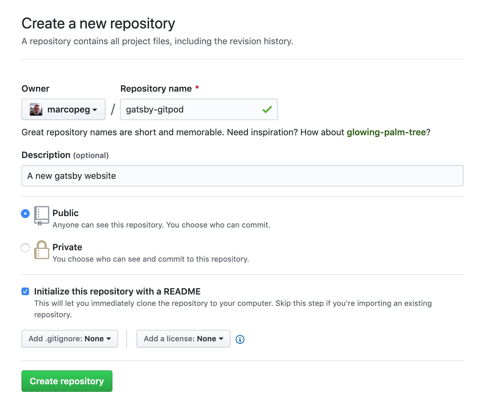
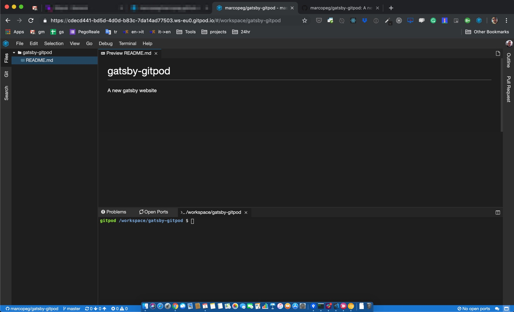
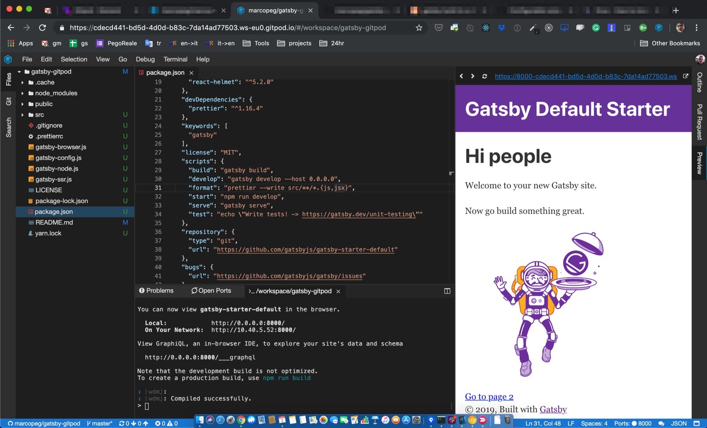
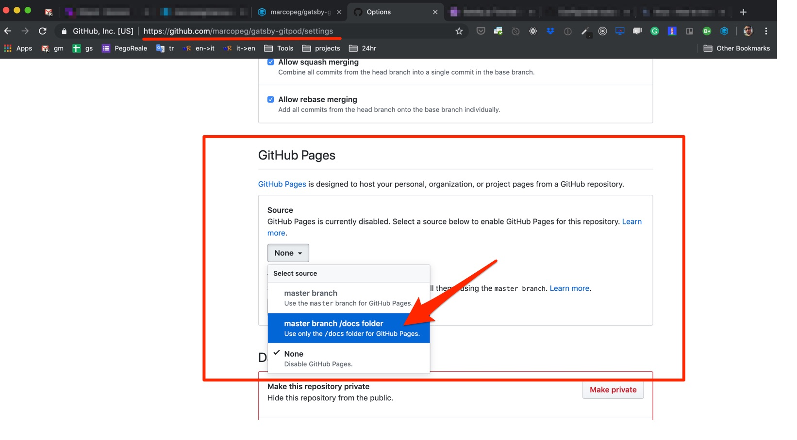
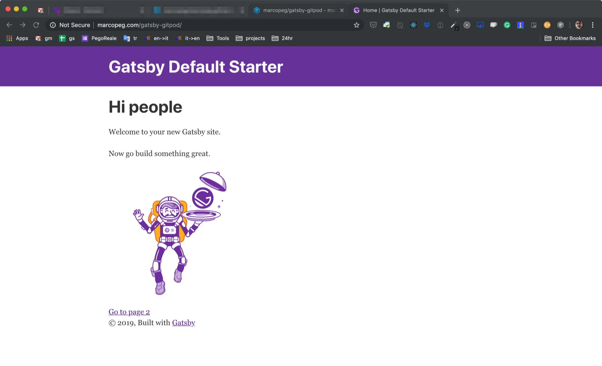

Just to make things 100% clear I am paying only for the custom domain "marcopeg.com".
**Everything else is free:**

- the hosting is provided by Github thanks to [Github Pages](https://pages.github.com/)
- the software and theme is build on [GatsbyJS](https://www.gatsbyjs.org/)
- the working and build environment uses the free tier grom [Gitpod.io](https://gitpod.io)

---

## Repository and Free Workspace

To host both the source code and the public html files you need just one Github repository.
Create a new public repository under your name and initialize it with a `README.md` file.

I have just created [marcopeg/gatsby-gitpod](https://github.com/marcopeg/gatsby-gitpod):

The step from your repo to a fully working NodeJS Workspace is just one url away!
Pick your repository url and prefix it with `gitpod.io/#{your-repo-url}`:

For me is going to be:

    gitpod.io/#https://github.com/marcopeg/gatsby-gitpod

NOTE: If this is your first time with Gitpod you need to give it the ability to handle your repository.

It's quite unbelievable. Gitpod.io gives you a fully working virtual environment that runs VSCode as web application.
It is based on Docker and you can configure almost everything about it. At the moment of writing they have
a **free plan of 100 hours/mo** that you can use for both public and private repositories.

---

## Init your Gatsby

Thanks to the new `npx` it's super easy to create a new Gatsby project. Run the following command in the terminal
that you find at the bottom of the IDE UI:

    npx gatsby new project

There is a small glitch here, Gatsby always generates a new project in a folder named after the project itself.
But I don't really want to have a nested folder so I run:

    rm README.md && mv -f ./project/{,.}* .
    rm -rf ./project

And it is finally time to kick your website alive. There is just one small adjustment that you need to operate
in your `package.json` so that Gitpod is able to render your project:

    # Find:
    "develop": "gatsby develop",

    # Change with:
    "develop": "gatsby develop --host 0.0.0.0",

Then run:

    yarn develop

The first time you run this command Gitpod will prompt you to open up the port:

And right after that, it will prompt you to open a live preview:

Here is the end result:

---

## Working on your Website

At this point you have 100 free working hours a month to customize and populate your website.

This tutorial aims to connect the dots between Gatsby, Gitpod and GitHub pages, so please refer to the
[Gatsby tutorial](https://www.gatsbyjs.org/tutorial/) for an in-depth guide to Gatsby development.

Just consider that **everything you do is live reloaded in the preview**, and that you can simply share
the link with a guy on the other side of the world, and he/she will enjoy the live reload as you type!

---

## Go Live on GitHub Pages

The easiest way to setup the GitHub pages for your repo is to populate the `/docs` folder with some HTML.

Gatsby actually does that for you, but you need to rename the folder afterward:

    yarn build
    rm -rf ./docs && mv ./public ./docs

Now commit and push the changes, then let's go to the GitHub repository's settings to enable GitHub pages:

After the page reloads, just scroll down again to the GitHub Pages section to find your website url.

**NOTE:** Quite often I've experienced a big delay for GitHub to actually create my website. Keep trying
for a few minutes, you can also try to push a new change.

---

## Run Gatsby as Subfolder

If you did like I did and set this up in a generic repository, chances are that you have a url like
`https://yourname.gihub.io/repo-name` and that the link to "Page 2" doesn't work at all.

That is because we both need to fix Gatsby so to work as sub-folder.

Open `gatsby-config.js` and add a new key `pathPrefix: '/repo-name'` to the configuration object. For me is
something like this:

    module.exports = {
        pathPrefix: '/gatsby-gitpod',
        siteMetadata: {
            title: `Gatsby Default Starter`,
            description: `Kick off your next, ...`,
            author: `@gatsbyjs`,
        },

Then open `package.json` and operate this change:

    # find
    "build": "gatsby build",

    # replace with
    "build": "gatsby build --prefix-paths",

Now you should be able to build and deploy again, and your website should work! (again, it may take some time for
GitHub to actually update the website. Try to refresh without cache or go incognito)

---

## Automate (slightly) the Deployment

Building on the NPM scripts I suggest you create a new "deploy" script in your `package.json`:

    "deploy": "yarn build && git add . && git commit -m \"publish\" && git push"

With this script in place you just need to `yarn deploy` to take your source code to production!

---

## Automate (slightly) the Workspace

Gitpod allows you to configure a good deal of things about the workspace. Start by creating a
`.gitpod.yml` file in your root:

    ports:
      - port: 8000
    tasks:
      - init: yarn install
        command: yarn develop
        openIn: bottom

Every time you will open the workspace Gitpod will pre-configure your port and start the development
enviroment so that you can focus 100% on you content!

---

## Conclusions

Gitpod.io is crazy good. I crunched some numbers and what I got out is that with their current proposed
pricing model it will take 8.5 enginering years (8h/day, 20d/month) to cover the price of a basic
MacBookPro.

Right now I am slightly moving some heavy projects on Gitpod so I can still enjoy my old MacBook (the super
light but really unpowerful one) and be happy with it!

